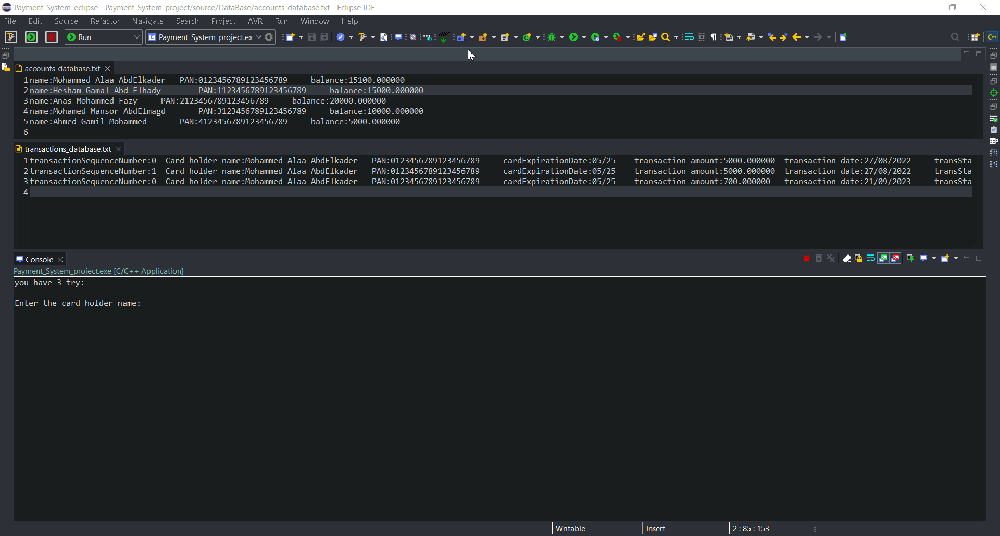

# Payment System
this system implement the sale transaction by simulating the card, terminal(ATM), and the server.

    the system consist of :
    - database which store the clients account with balance and the transactions history 
    - the program read the card data with needed money then process that to update the the balance in accounts database and update the transaction database history. 

## Application Flowchart:

## Payment System modules folders:

## the application test scenario:

### Transaction approved user story:

- As a bank customer have an account and has a valid and not expired card, I want to withdraw an amount of money less than the maximum allowed and less than or equal to the amount in my balance, so that I am expecting that the transaction is approved and my account balance is reduced by the withdrawn amount.

- As a bank customer have an account, that has a valid and not expired card, I want to withdraw an amount of money that exceeds the maximum allowed amount so that I am expecting the transaction declined.

- As a bank customer have an account and has a valid and not expired card, I want to withdraw an amount of money less than the maximum allowed and larger than the amount in my balance so that I am expecting that the transaction declined.

- As a bank customer have an account and a valid but expired card, I want to withdraw an amount of money so that I expect that the transaction declined.

- As a bank customer have an account and has a valid and not expired but stolen card, I want to block anyone from using my card so that I am expecting that any transaction made by this card is declined.
